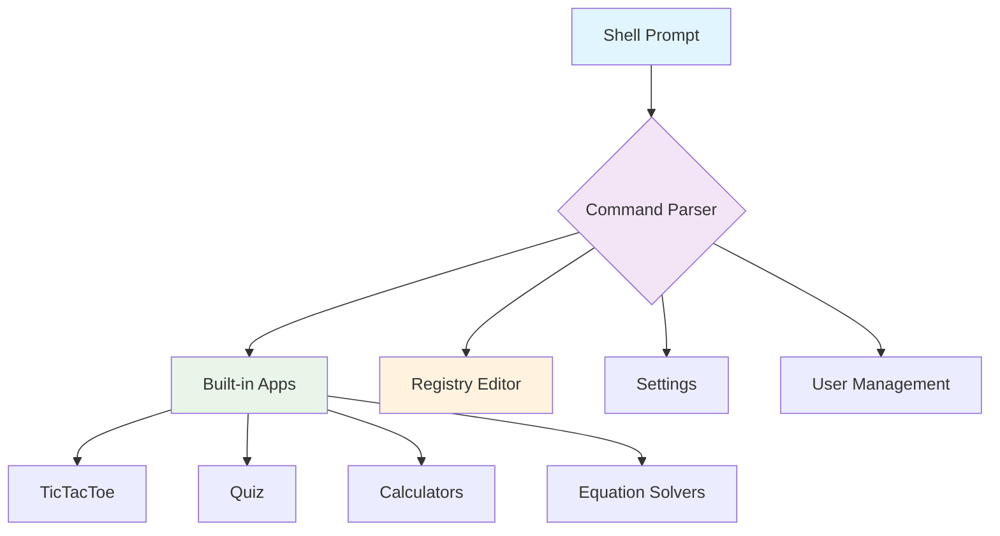

---

# 🔧 Operating Environment – Original Linux Implementation

<div align="center">


**Complete source code history of a hobby operating environment built from scratch (2020–2021)**

*Four major releases, multiple under‑development builds, and a fully functional console‑based shell with built‑in applications*

</div>

## 📋 Table of Contents
- [🌟 Overview](#-overview)
- [🏗️ Repository Structure](#️-repository-structure)
- [🚀 Key Features Across Versions](#-key-features-across-versions)
- [🖥️ System Architecture](#️-system-architecture)
- [📦 Historical Context](#-historical-context)
- [👨‍💻 Developer](#-developer)

## 🌟 Overview

This repository archives the **original Linux‑based implementation** of *Operating Environment* (OE) – a hobby project started during online school classes. OE is a console‑based “operating environment” that provides:

- A command‑driven shell with a prompt and help system  
- Multiple built‑in applications (games, utilities, solvers)  
- User management (login, guest mode, password protection)  
- A simple “registry” system to track application installation  
- A hidden registry editor for power users  
- Settings panel for personalization and system restore  

All versions are written in **C++** (with some C‑style code) and rely on **Linux system calls and ANSI escape sequences** for terminal control. No external libraries are used – everything is hand‑crafted.

## 🏗️ Repository Structure

```
📦 Operating Environment Linux Based - Original Implementation
├── 📁 Stable Releases/          # Officially released, stable versions
│   ├── 📄 README.md
│   ├── 📁 v1.0/                 # First release (TicTacToe, Quiz, Calculator, Temp_Conv)
│   ├── 📁 v2.01/                # Added equation solver, bootscreen, faster installer
│   ├── 📁 v3.0/                  # Difficulty levels, registry editor, cheat codes
│   └── 📁 v4.05.08/              # Quadratic equation solver, settings app, Kelvin support
│
├── 📁 Under_dev Builds/          # Experimental builds and work‑in‑progress snapshots
│   ├── 📄 README.md
│   ├── 📁 v4.05.11/
│   ├── 📁 v4.05.12/
│   └── 📁 v4.23.09/
│
└── 📄 README.md                   # You are here
```

Each version folder contains:
- The complete source code (`.cpp`, `.h` files)
- A dedicated `README.md` detailing the changes and features of that release
- (For newer versions, multiple headers like `sources.h`, `programs.h`, `looks.h`)

## 🚀 Key Features Across Versions

### 🎮 Applications
| Version | Applications |
|---------|--------------|
| **v1.0** | Tic‑Tac‑Toe, Quiz, Calculator, Temperature Converter |
| **v2.01** | + Pair of Linear Equations Solver |
| **v3.0** | + Difficulty levels in TicTacToe, enhanced Quiz, Registry Editor |
| **v4.05.08** | + Quadratic Equation Solver, Settings App, Area of Triangle (CO) |

### 🔧 System Features
- **User Management** – Login, guest mode, password creation/removal, user ID change
- **Registry System** – Tracks which apps are “installed” via simple text files
- **Registry Editor** – Hidden tool for power users (admin/limited modes)
- **Settings Panel** – Centralised control for user accounts, reset/restore, and personalisation (border color)
- **Bootscreens** – Custom loading screens for each application
- **Cheat Codes** – Hidden shortcuts in games (e.g., instant win in TicTacToe)

### 🛠️ Technical Highlights
- Pure C++ (no external libraries)
- ANSI escape sequences for colours and cursor positioning
- File‑based “registry” (flat text files)
- Platform‑specific code for Linux (`system("clear")`, `usleep`, etc.)
- Modular (by function) but not yet separated into `.h`/`.c` pairs – preserved as originally written

## 🖥️ System Architecture



**Core Components:**
- **`main.cpp`** – Entry point, bootscreen, initialises user session
- **`sources.h` / `Sources2.h`** – Function declarations and shared code
- **`programs.h`** – Game and utility implementations
- **`looks.h`** – Colour definitions and border macros
- **Registry files** – `.txt` files storing installation status (e.g., `TicTacToe.txt`)

## 📦 Historical Context

> *"During the COVID lockdown, my teacher asked me to build a quiz app for conducting online quizzes. That single program grew into an entire operating environment."*

**Timeline:**
- **Mid‑2020** – v1.0: First release (quiz, tictactoe, calculator, temp converter)
- **Late 2020** – v2.01: Added equation solver, bootscreen, single login
- **Early 2021** – v3.0: Difficulty levels, registry editor, cheat codes
- **Late 2021** – v4.05.08: Quadratic solver, settings app, Kelvin support
- **Under‑dev builds** – Experimental features and refinements

This repository preserves the exact source code of each version, exactly as it was when released or saved. It is a **historical archive**, showing the evolution of a hobby project over two years. Some code may be messy, some features may be unfinished – but that is the beauty of a genuine learning journey.

## 👨‍💻 Developer

<div align="center">

### **Subhajit Halder** 💻


📧 **Email**: [subhajithalder267@outlook.com](mailto:subhajithalder267@outlook.com)

</div>

### 🛠️ What This Project Represents
- **Self‑taught programming** – Learned from books, YouTube, Stack Overflow, GeeksforGeeks
- **Perseverance** – Four major releases and countless improvements
- **Systems thinking** – Building a cohesive environment from scratch
- **Creative problem‑solving** – Implementing features like a registry editor, cheat codes, and a full settings panel in a console

### 🔗 Related Repositories
- [**OE Windows Based**](https://github.com/yourusername/oe-windows) – Ports of the same environment to Windows (C++ legacy and C modern)
- [**OE Reboot**](https://github.com/yourusername/oe-reboot) – A clean, portable rewrite in C with platform abstraction, aiming for bare‑metal execution

---

<div align="center">

### **Exploring the Roots of a Systems Programming Journey** 🌱

*Every expert was once a beginner. This is the record of that beginning.*

</div>

---

Now you can place this as the root `README.md` in your Linux repo. When you're ready, send me the details (or the actual code) for any specific release folder (e.g., v1.0, v2.01, etc.) and I'll generate a similarly styled README for that version, including its own features, changelog, and compilation instructions.
